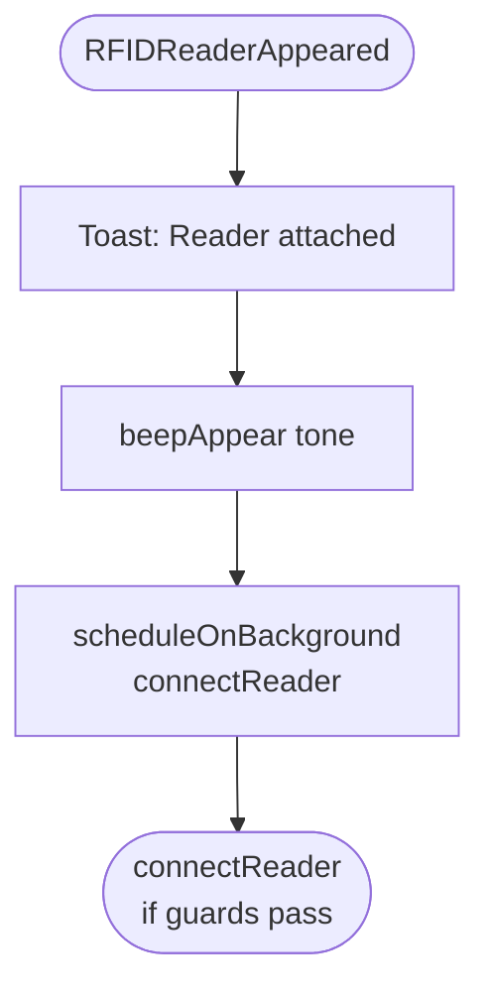
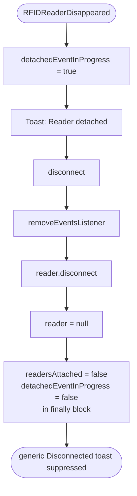
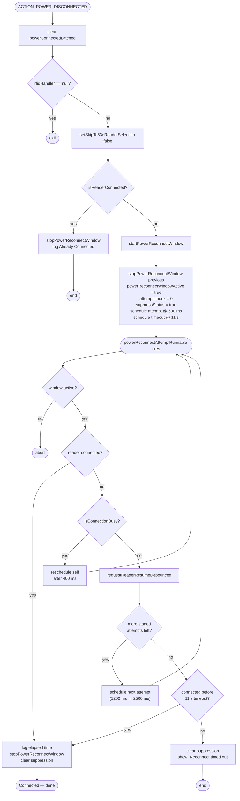

# DESIGN

Repository: TC53eBSP_TestRFD40

This document defines the current RFID connection lifecycle and event behavior for:
- init
- connect
- disconnect
- reader detach/attach
- power cable connected/disconnected

It is aligned with:
- `app/src/main/java/com/zebra/rfid/demo/sdksample/MainActivity.java`
- `app/src/main/java/com/zebra/rfid/demo/sdksample/RFIDHandler.java`
- runtime logs from 2026-06-17.

## 1) Architecture

- `MainActivity`
  - Owns Android lifecycle and permission flow.
   - Owns USB power broadcast receiver with active handling for `ACTION_POWER_DISCONNECTED`.
   - Maintains reconnect-window state (`powerReconnectWindowActive`) and UI suppression state (`suppressReconnectStatusUntilConnected`).
  - Calls `RFIDHandler` lifecycle methods.
- `RFIDHandler`
  - Owns SDK init/discovery/connect/disconnect and reconnect guards.
  - Owns reader attach/disappear callbacks via `Readers.RFIDReaderEventHandler`.
- `RFIDHandler.EventHandler`
  - Owns runtime reader status events (`DISCONNECTION_EVENT`, trigger events, read events).

## 2) State and Concurrency Guards

`RFIDHandler` uses:

```java
private volatile boolean initializationInProgress = false;
private volatile boolean connectionInProgress = false;
private volatile boolean resumeRequested = false;
private volatile boolean readersAttached = false;
private volatile boolean detachedEventInProgress = false;
private volatile boolean skipTc53eReaderSelection = false;
```

Guard intent:
- `resumeRequested`: foreground intent to stay connected.
- `initializationInProgress`: prevents duplicate `initSdk()`.
- `connectionInProgress`: prevents connect overlap.
- `readersAttached`: prevents duplicate `readers.attach(this)`.
- `detachedEventInProgress`: suppresses redundant "Disconnected" toast when detach already reported.

`MainActivity` adds reconnect UX and bounded retry guards:

```java
private static final long READER_RESUME_DEBOUNCE_MS = 1200L;
private static final long POWER_CONNECTED_EVENT_DEBOUNCE_MS = 2000L;
private static final long[] POWER_RECONNECT_ATTEMPT_DELAYS_MS = new long[]{500L, 1200L, 2500L};
private static final long POWER_RECONNECT_SUPPRESSION_TIMEOUT_MS = 11000L;
private static final long POWER_RECONNECT_BUSY_RETRY_DELAY_MS = 400L;
private boolean suppressReconnectStatusUntilConnected = false;
private boolean powerReconnectWindowActive = false;
private int powerReconnectAttemptIndex = 0;
private long powerReconnectStartedAtMs = 0L;
```

Intent:
- debounce burst reconnect requests (`onPostResume`, USB events).
- schedule staged reconnect retries after cable unplug.
- retry with short delay when handler is busy (`isConnectionBusy()`).
- hide noisy intermediate reconnect errors until final connected status or timeout.

## 3) Lifecycle Contract

### 3.1 Init

Entry points:
- `MainActivity.initializeRfidHandlerIfPermitted()` -> `rfidHandler.onCreate(this, this)`
- `RFIDHandler.onResume()` when `readers == null`

Behavior:
1. `onCreate` immediately calls `initSdk()`.
2. `initSdk()` is idempotent while `initializationInProgress == true`.
3. Background `createInstanceAndConnect()` builds `Readers(ENUM_TRANSPORT.ALL)`.
4. If reader list empty, retry discovery via `RE_USB` up to `MAX_DISCOVERY_RETRIES`.
5. If `resumeRequested` is still true, hand off to `connectReader()`.

Expected log shape (matches provided logs):
- `STEP: InitSDK`
- `STEP: InitSDK initializationInProgress, createInstanceAndConnect`
- duplicate calls show `STEP: Skip Duplicated InitSDK`

### 3.2 Connect

Entry points:
- `RFIDHandler.onResume()`
- `RFIDReaderAppeared(...)`
- `EventHandler.DISCONNECTION_EVENT` recovery

Behavior:
1. `connectReader()` exits early when any guard blocks (`!resumeRequested`, init in progress, connect in progress, already connected).
2. `getAvailableReader()` ensures `readers.attach(this)` once-per-cycle.
3. Reader selection prefers RFD403 family (eConnex), then RFD40+, then first fallback.
4. `connect()` measures connection duration, calls `configureReader()`, reports status.
5. `finishConnectionAttempt(...)` always clears `connectionInProgress`.

Expected log shape:
- `STEP: connectReader connectionInProgress`
- `STEP: getAvailableReader`
- `STEP: finishConnectionAttempt(connect())`
- `STEP: Reader Connected in Xms`

### 3.3 Disconnect

Entry points:
- `MainActivity.onPause()`
- menu disconnect action
- USB `ACTION_POWER_CONNECTED`
- `RFIDReaderDisappeared(...)`
- `DISCONNECTION_EVENT` cleanup

Behavior:
1. `RFIDHandler.onPause()` sets `resumeRequested=false`, `connectionInProgress=false`, then `disconnect()`.
2. `disconnect()` removes event listener, disconnects reader, clears `reader`, resets attach flag in `finally`.
3. If detach callback already fired (`detachedEventInProgress=true`), generic disconnect toast is suppressed.

## 4) Reader Attach / Detach Event Handling

### Attach (`RFIDReaderAppeared`)

Behavior:
1. Toast "Reader attached: <name>".
2. Audible appear tone.
3. Schedule `connectReader()`.

### Detach (`RFIDReaderDisappeared`)

Behavior:
1. Set `detachedEventInProgress=true`.
2. Toast "Reader detached: <name>".
3. Call `disconnect()` for cleanup.

Design result:
- detach is treated as authoritative state loss.
- next connection cycle re-attaches via `readers.attach(this)` because `readersAttached=false` is forced in `disconnect()`.

### Flowchart: Attach



### Flowchart: Detach



## 5) Power Cable Behavior (TC53e / EM45 flow)

Power handling is implemented in `MainActivity.mBatteryReceiver`.

### 5.1 `ACTION_POWER_CONNECTED` in current code

Current behavior:
1. receiver subscribes to `ACTION_POWER_CONNECTED`.
2. the body handling this action is currently commented out.
3. no active disconnect action is executed on this broadcast in the current implementation.

Reason:
- code retains prior disconnect strategy in comments for potential future enablement.

### 5.2 `ACTION_POWER_DISCONNECTED` -> reconnect with suppression

Current behavior:
1. log `ACTION_POWER_DISCONNECTED` and clear `powerConnectedLatched`.
2. guard exits when `rfidHandler == null`.
3. call `rfidHandler.setSkipTc53eReaderSelection(false)` so host reader skip mode is disabled.
4. if `isReaderConnected()` is already true, stop reconnect window, emit "Already Connected", and return.
5. otherwise call `startPowerReconnectWindow()`.

`startPowerReconnectWindow()` behavior:
1. cancel any previous reconnect window/timer state via `stopPowerReconnectWindow()`.
2. set window state:
   - `powerReconnectWindowActive = true`
   - `powerReconnectAttemptIndex = 0`
   - `powerReconnectStartedAtMs = SystemClock.elapsedRealtime()`
   - `suppressReconnectStatusUntilConnected = true`
3. schedule first attempt with delay `POWER_RECONNECT_ATTEMPT_DELAYS_MS[0]` (500ms).
4. schedule hard timeout at `POWER_RECONNECT_SUPPRESSION_TIMEOUT_MS` (11s).

`powerReconnectAttemptRunnable` behavior:
1. abort when window inactive.
2. stop window if reader becomes connected.
3. if handler is busy (`isConnectionBusy()`), reschedule self after `POWER_RECONNECT_BUSY_RETRY_DELAY_MS` (400ms).
4. request reconnect via `requestReaderResumeDebounced("power_disconnected_retry_<n>", true)`.
5. schedule next staged attempt at 1200ms then 2500ms until the bounded attempt list is exhausted.

Status suppression behavior while reconnecting:
1. `sendToast(...)` and `onReaderStatusUpdate(...)` call `shouldSuppressReconnectStatus(...)`.
2. non-connected intermediate statuses are suppressed while `suppressReconnectStatusUntilConnected` is true.
3. first status containing "connected" logs elapsed time, stops window, and clears suppression.
4. on timeout, suppression is cleared and UI shows: "Reconnect timed out after cable unplug" when still disconnected.

Reason:
- immediate post-unplug reconnect can transiently throw transport open errors.
- staged retries and bounded suppression reduce race noise while preserving final user-visible outcome.

### Flowchart: ACTION_POWER_DISCONNECTED



## 6) Event-to-Action Matrix

| Event | Owner | Action | Target Outcome |
|---|---|---|---|
| App create | MainActivity | init handler and call `onCreate` | SDK init starts |
| App post-resume | MainActivity | `requestReaderResumeDebounced` | connect or resume existing connection |
| App pause | MainActivity | `rfidHandler.onPause()` | disconnect cleanly |
| Reader appeared | RFIDHandler | toast + tone + `connectReader` | attach/reconnect quickly |
| Reader disappeared | RFIDHandler | mark detached + toast + disconnect | clean state and stop I/O |
| SDK disconnection event | EventHandler | disconnect + reconnect if active | auto recovery while foreground |
| Power connected | MainActivity | currently subscribed, handler body commented out | no active power-connected policy applied |
| Power disconnected | MainActivity | debounced reconnect with suppression | stable reconnect without noisy UX |

## 7) Sequence for Provided 2026-06-17 Logs

### Initial launch

1. `Step 1: Init RFIDHandler Class`
2. `Step 2: rfidHandler.onCreate ...`
3. `STEP: InitSDK`
4. `onPostResume` requests reconnect
5. second `initSdk()` is skipped (duplicate guard)
6. connect path runs and reaches `Reader Connected in 344ms`

This confirms idempotent init + single active connection attempt semantics.

### Reader attach cycle

1. attach event leads to connect attempt
2. `getAvailableReader` + `connect()`
3. connected in ~417ms

This confirms attach callback pipeline is working.

### Power connected (cable inserted)

1. `ACTION_POWER_CONNECTED`
2. current code path is commented out
3. no active disconnect is performed by this receiver branch

This differs from earlier forced-disconnect policy and should be treated as intentional current behavior unless re-enabled.

### Power disconnected (cable removed)

1. start bounded reconnect window
2. schedule staged retries after short settle delays (500ms, 1200ms, 2500ms)
3. keep intermediate reconnect status suppressed
4. stop suppression on success, or end with explicit timeout status at 11s

Interpretation:
- transient transport race exists after cable removal.
- staged retries reduce first-attempt race failures and preserve clean UX.

## 8) Required Handling Rules (Normative)

These rules should remain true when code is modified:

1. Init idempotency
   - duplicate `initSdk()` calls must be harmless.
2. Single in-flight connect
   - never allow parallel connect attempts.
3. Detach-first cleanup
   - detach must always clear listener + connection state.
4. Cable-in policy state
   - `ACTION_POWER_CONNECTED` handling is presently disabled/commented; reconnect logic must not assume forced cable-in disconnect occurred.
5. Cable-out reconnect
   - on power disconnected, reconnect through bounded backoff attempts.
6. Suppressed transient errors
   - during cable-out reconnect, hide interim errors until final connected status or reconnect timeout.

## 9) Code Review Findings

### Resolved In Current Code

1. `ACTION_POWER_DISCONNECTED` now uses explicit settle delays and bounded retries.
   - Implemented via staged retry runnable in `MainActivity`.

2. `ACTION_POWER_CONNECTED` receiver path is currently retained as commented logic.
   - Current active behavior does not force disconnect on cable insert.

3. Reconnect suppression now has explicit upper bound timeout and surfaces a final timeout message if still disconnected.

### Medium

1. Reconnect backoff values are currently fixed constants and may require per-device tuning.
   - Recommendation: tune delays from field telemetry for TC53e/EM45 profiles.

### Low

1. A few disconnect messages differ across paths (detached vs disconnected wording), which can make field logs harder to aggregate.
   - Recommendation: standardize status strings by event class.

## 10) Suggested Next Increment

Add telemetry counters for reconnect outcomes:
- count attempts per unplug cycle
- measure time-to-reconnect
- track timeout frequency by device model

This will let reconnect constants be tuned using production evidence.
