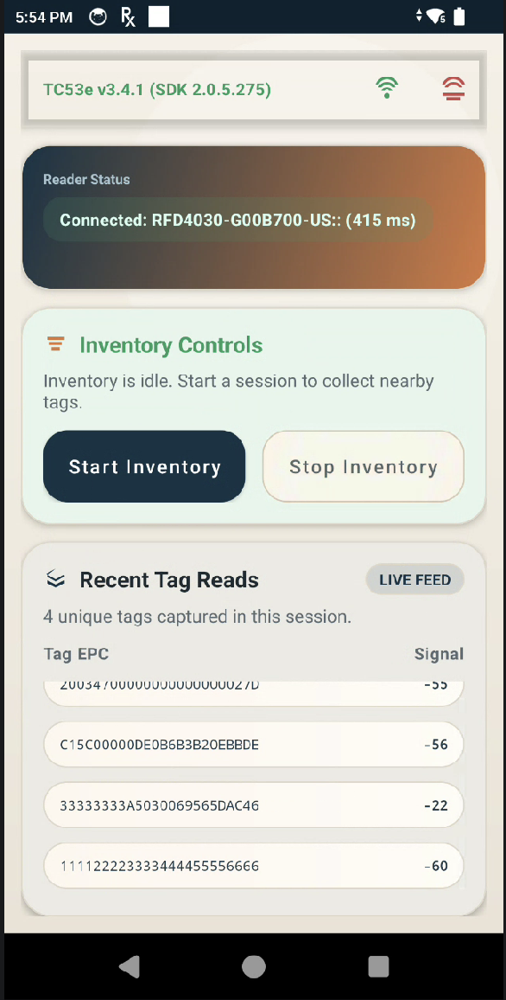

# TC53e / TC22 RFID SDK Sample - BSP Test (v3.4.1 - Kotlin Edition)

**Author:** Chuck  
**Date:** 2026-06-18

Android sample app (Kotlin) for Zebra handheld RFID devices including RFD40 support. The app connects to an available RFID reader, starts/stops inventory, and displays EPC + RSSI values in real time. This repository is maintained for BSP testing and validation.

Recent maintenance updates include explicit reader selection, Android 12+ permission-safe initialization, and batched UI refresh for high-frequency tag reads.



This project has been converted from Java to Kotlin (v2.0.0) with updated lifecycle management and modern idiomatic improvements.

## Project Summary

- **App ID:** `com.zebra.rfid.demo.sdksample`
- **Main screen:** `MainActivity`
- **RFID integration:** `RFIDHandler`
- **Target devices:** Zebra TC53e / TC22 class devices with supported RFID transport
- **SDK inputs:** Zebra `.aar` libraries under `app/libs`

## Requirements

- macOS (or Linux/Windows with equivalent tools)
- Android SDK + platform/build tools installed
- `adb` available in terminal `PATH`
- **Java 17** for Android Gradle Plugin 8.13.x
  - This repo is configured to use Android Studio bundled JBR in VS Code task
- Connected Android device with Developer Options + USB debugging enabled

## Build / Deploy / Run (Automated)

A VS Code task is included in `.vscode/tasks.json`:

- **Task label:** `Android: Build Deploy Run (Debug)`
- **What it does:**
  1. Builds debug APK
  2. Installs debug APK on connected device
  3. Launches `com.zebra.rfid.demo.sdksample/.MainActivity`

### Run the task

- VS Code menu: **Terminal → Run Task... → Android: Build Deploy Run (Debug)**
- or Command Palette: **Tasks: Run Task**

### Root one-click scripts

Project root also includes one-click scripts:

- `./runhh` (wrapper)
- `./runhh.sh` (main script)

They:
1. Set Java 17 (`JAVA_HOME`) for AGP compatibility
2. Verify `adb` and at least one connected device
3. Build + install debug APK
4. Launch `com.zebra.rfid.demo.sdksample/.MainActivity`

## Manual Commands

If you prefer terminal commands:

```bash
export JAVA_HOME="/Applications/Android Studio.app/Contents/jbr/Contents/Home"
export PATH="$JAVA_HOME/bin:$PATH"

./gradlew :app:assembleDebug :app:installDebug
adb shell am start -n com.zebra.rfid.demo.sdksample/.MainActivity
```

## App Usage

1. Launch app.
2. Grant Bluetooth permissions on Android 12+.
3. Use top-right menu:
   - **Connect** to initialize and connect reader
   - **Disconnect** to release reader
4. Tap **Start Inventory** to begin reading tags.
5. Tap **Stop Inventory** to stop reading.
6. Observe unique tag output in the on-screen list (`TAG_ID, RSSI`). The latest RSSI value is kept per tag and UI refreshes are batched to reduce churn during fast inventory reads.

## Important Notes

- Build may show warnings about duplicate namespaces/permissions from vendor `.aar` files; these originate from bundled SDK artifacts.
- `Scan`/barcode path is scaffolded but currently not active in UI flow.
- Recent maintenance updates include:
  - **Java to Kotlin Conversion**: Entire source code migrated to Kotlin 2.0.0.
  - `AsyncTask` migration to executor-based background processing in `RFIDHandler`
  - receiver lifecycle cleanup in `MainActivity` (`register`/`unregister`)
  - Android 12+ Bluetooth permission result validation for both `BLUETOOTH_SCAN` and `BLUETOOTH_CONNECT`
  - permission-safe RFID handler initialization/resume guards in `MainActivity`
  - explicit reader selection priority and logging in `RFIDHandler`
  - DISCONNECTION_EVENT auto-reconnect handling for BT/USB transport drops
  - unique-tag display with batched `ListView` refresh for smoother inventory UI
  - generic status toasts no longer clear tag results
  - removed disabled test button and unused scanner/test scaffolding
  - moved main layout text to `strings.xml` and switched left-only margins to start-aware margins

## Repository Contents

- `app/src/main/java/com/zebra/rfid/demo/sdksample/MainActivity.kt` (Application UI & USB state manager)
- `app/src/main/java/com/zebra/rfid/demo/sdksample/RFIDHandler.kt` (Zebra RFID SDK connector)
- `app/libs/*.aar` (Zebra SDK dependencies)
- `.vscode/tasks.json` (automated build/deploy/run)
- `runhh` and `runhh.sh` (root automation scripts)
- `TC53eDesign.md` (architecture + review - Kotlin based)
- `code.md` (interactive runtime playbooks)
- `TC53eUsbOTG.md` (USB, power connected, charging and pass-through policies review - Kotlin based)

## Change History

### 2026-06-18

- Version: `v3.4.1` (Kotlin Migration and USB/OTG Implementation)
- **Converted full project source from Java to Kotlin.**
- Updated Gradle build scripts for Kotlin 2.0.0 support.
- Added active USB power broadcast and transport state monitors:
  - Subscribed receiver branches for `ACTION_USB_STATE`, `ACTION_POWER_CONNECTED`, and `ACTION_POWER_DISCONNECTED`.
  - Parses system transport flag states (`mtp`, `ptp`, `mass_storage`, `adb`, `rndis`) in `updateUsbModeFromIntent`.
- Formulated mode-specific connection and disconnection policies:
  - **Power-Only (Charging adapter)**: Drops standard host-reader sessions gracefully via `rfidHandler.onPause()`, sets the host omission index (`skipTc53eReaderSelection` to `true`), and allows pass-through charging without interface selection conflicts.
  - **USB Data/File Transfer/Debug Mode**: Keeps RFID connections active until hardware physically detaches from the system to preserve debugging sessions.
  - **TC22R Gating**: Implemented `rfidHandler.isTC22R()` evaluation which ignores standard USB broadcast receiver blocks.
- Strengthened power-unplug debouncing:
  - Established a staggered reconnect schedule ($500\text{ ms} \to 1200\text{ ms} \to 2500\text{ ms}$) under `startPowerReconnectWindow()`.
  - Added busy checks (`rfidHandler.isConnectionBusy()`), automatic timeouts at $11,000\text{ ms}$, and UI status suppression on intermediate errors to avoid status logs noise.
- Created `TC53eDesign.md` and `TC53eUsbOTG.md` reflecting Kotlin base.
- **Verified USB Charging Flow**: Documented a full trace of power-plug disconnect and power-unplug reconnect (1900ms restoration) in `TC53eDesign.md` and `TC53eUsbOTG.md`.

### 2026-06-17 (Pre-Kotlin Migration)

- `RFIDHandler` code cleanup:
  - `TAG` changed to `private`
  - `Log.e` → `Log.d` in `getAvailableReader()`; removed redundant size log
  - Removed duplicate `connect()` hostname log
  - Removed `//Before`/`//After` noise comments
  - Simplified `getAndroidDeviceSerialNumber()`: removed dead null check, unreachable try/catch, and unreachable Approach 4; removed unused `Settings` import
  - Removed redundant `reader = null` in `dispose()`
  - Collapsed `isTC22R()` to single-expression return
  - Removed `synchronized` from `beep()`/`beepAppear()`; corrected log messages
- Updated `DESIGN.md` code snippets to reflect `skipTc53eReaderSelection` and `POWER_CONNECTED_EVENT_DEBOUNCE_MS`

### 2026-06-15

- Version: `v3.4` (maintenance + automation update)

- Added robust build/deploy/run automation in `runhh.sh`:
  - `adb` discovery fallback for macOS SDK path
  - clear no-device / multi-device diagnostics
  - `--serial`, `--clean`, `--skip-build`, `--skip-install` options
  - app launch verification via PID check
- Updated `.vscode/tasks.json` to use `runhh.sh` tasks:
  - default debug build/deploy/run
  - prompt-driven device serial task
  - clean build variant
- Improved `RFIDHandler` lifecycle and reliability:
  - hardened connect/disconnect guards
  - re-attach logic via `readersAttached` reset on disconnect
  - null-safe reader list handling during SDK init/discovery
  - reduced high-frequency tag logging overhead with debug sampling
  - deterministic eConnex reader matching (removed broad generic match)
  - app title now updates after connect to include SDK version (for example: `TC53e v3.4.1 (SDK 2.0.5.238)`)
- Refreshed `DESIGN.md` with detailed implementation snippets for init, discovery, connect, disconnect, reconnect, and attach/detach behavior.

## Troubleshooting

- **Error: AGP requires Java 17**  
  Ensure `JAVA_HOME` points to Java 17 (or run the provided VS Code task).
- **No reader found**  
  Verify hardware attachment/transport mode and that the device supports the configured reader transport.
- **Reader selection behavior**  
  The app selects readers in a deterministic order: `RFD403` eConnex first, then `RFD40` family Bluetooth sleds, and finally falls back to the first available reader with a visible warning.
- **`adb` not found**  
  Add Android SDK platform-tools to your shell `PATH`.
