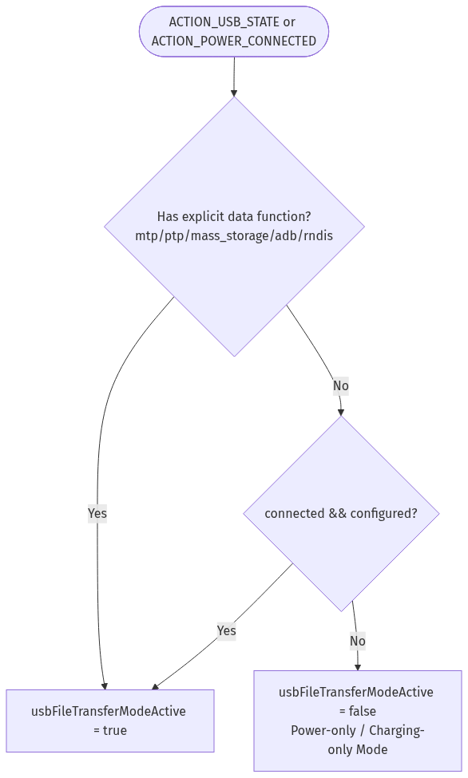

# USB/OTG Review (TC53e + RFD40)

## Scope
This review covers USB-related RFID connection and disconnection behavior under various device modes (charging-only, file transfer, debug mode, and general RFID operations) in:
- [app/src/main/java/com/zebra/rfid/demo/sdksample/MainActivity.java](app/src/main/java/com/zebra/rfid/demo/sdksample/MainActivity.java)
- [app/src/main/java/com/zebra/rfid/demo/sdksample/RFIDHandler.java](app/src/main/java/com/zebra/rfid/demo/sdksample/RFIDHandler.java)

## 1. Gating & USB Mode Detection

The application implements active USB broadcast and state monitoring. It listens to three key intents registered in [MainActivity.java](app/src/main/java/com/zebra/rfid/demo/sdksample/MainActivity.java#L215-L225):
- `android.hardware.usb.action.USB_STATE` (`ACTION_USB_STATE`)
- `android.intent.action.ACTION_POWER_CONNECTED` (`ACTION_POWER_CONNECTED`)
- `android.intent.action.ACTION_POWER_DISCONNECTED` (`ACTION_POWER_DISCONNECTED`)

### Mode Determination logic
USB features are decoded in `updateUsbModeFromIntent(Intent, String)` where the system parses the following boolean intent extras:
- `connected` / `configured`
- Explicit transport functions: `mtp`, `ptp`, `mass_storage`, `adb`, `rndis`

The state flag `usbFileTransferModeActive` is used to decide whether to trigger immediate disconnection:
- **Interactive / Data Link Mode (File Transfer / Debug)**: Activated if any transport function (`mtp`, `ptp`, `mass_storage`, `adb`, `rndis`) is `true`.
- **Fallback Rule**: In custom operating system builds where individual function extras are not broadcasted, the fall-back checks if the USB configuration is both `connected` and `configured` to infer an active data connection.
- **Power-Only (Charging-Only)**: Inferred when `ACTION_POWER_CONNECTED` is fired but `usbFileTransferModeActive` is `false`.

---

## 2. Mode-Specific Connection & Disconnection Behavior

### 2.1 Power-Only Gating (Pass-through Charger)
* **Design Goal**: Disconnect from the active session on a shared-USB reader during charging and allow pass-through charging. Skip selecting the host reader device while powered.
* **On Intent (`ACTION_POWER_CONNECTED`)**:
  1. Activates host suppression: `rfidHandler.setSkipTc53eReaderSelection(true)`.
  2. Stops the reader session cleanly on the background thread: `rfidHandler.onPause()`.
  3. Displays a warning toast: `"RFID disconnected while USB power cable connected"`.
* **On Intent (`ACTION_POWER_DISCONNECTED`)**:
  1. Restores default search modes: `rfidHandler.setSkipTc53eReaderSelection(false)`.
  2. Orchestrates debounced reconnection attempts using a timed retry window (`startPowerReconnectWindow()`).

### 2.2 USB File Transfer / Debug Mode
* **Design Goal**: Retain the RFID session until the reader hardware physically disappears (authoritative detachment) during data transfers and software debugging.
* **On Intent (`ACTION_POWER_CONNECTED`)**:
  1. Preserves host-reader fallback flags: `rfidHandler.setSkipTc53eReaderSelection(false)`.
  2. Forgets previous power latches and warns the user that files are being shared/debugged, but does **not** command an automatic force-disconnect.
  3. Displays a warning status popup: `"USB file transfer active or debug mode\r\nRFID Disconnected\r\nWait for USB cable unplug for reconnect"`.

### 2.3 Reader-Detached & Disappear Events
* **Design Goal**: Hard detachment and state cleanup are prioritized over power state checks when the hardware is decoupled.
* **On Event (`RFIDReaderDisappeared`)**:
  1. Authoritatively registers state: `detachedEventInProgress = true`.
  2. Immediately proceeds with state cleanup in [RFIDHandler.java](app/src/main/java/com/zebra/rfid/demo/sdksample/RFIDHandler.java#L498):
     - Unregisters the event listener from `Reader.Events`.
     - Safely closes connection transport handled by `reader.disconnect()`.
     - Clears the instance: `reader = null` and resets `readersAttached = false` inside `finally` block to allow fresh bindings in the next lifecycle.
  3. UI warning text: `"Reader detached: <name>"`. The generic generic disconnect toast is suppressed to avoid redundant status noise.

### 2.4 TC22R Bypass
* **Design Goal**: Guard standard TC22R operations against accidental USB-state interruptions.
* **Logic Gating**: Evaluated via `rfidHandler.isTC22R()`. If `true`, the broadcast receiver bypasses the entire USB disconnect policy block, outputs `STEP: TC22R, ignore ACTION_POWER_CONNECTED`, and confirms active operational status directly on the interface.

---

## 3. Reconnect Retries and Suppression Window

To handle immediate transport races that can occur right after the cable is unplugged, the app implements a bounded retry schedule in [MainActivity.java](app/src/main/java/com/zebra/rfid/demo/sdksample/MainActivity.java#L133-L191):

1. **Backoff Delays**: Attempts are staggered at `500 ms` $\to$ `1200 ms` $\to$ `2500 ms` to allow port states and physical interfaces to settle down.
2. **Busy Checks**: Before executing `requestReaderResumeDebounced()`, the handler evaluates `rfidHandler.isConnectionBusy()`. If initialization or another connection attempt is active, it reschedules itself after a short `400 ms` delay instead of causing concurrent thread calls.
3. **UX Suppression**: During this `11,000 ms` window, intermediate transport failures (e.g., `RFID_COMM_OPEN_ERROR`) are hidden from the user interface.
4. **Outcome Hook**:
   - **Success**: If a loop succeeds and reports a status containing `"connected"`, the reconnect window is immediately closed, and suppression state is cleared.
   - **Timeout**: If the window times out, it displays: `"USB in used!!!\r\nUnplug the USB cable for reconnect"`.

---

## 4. Current State Matrix

| Feature / Scenario | Mode Decided | Skip Selection Flag | RFID Connect Policy | Expected UI Status / Toast |
|---|---|---|---|---|
| **AC Charger Connected** | Charging Only | `true` | Call `onPause()`, Disconnect | `RFID disconnected while USB power cable connected` |
| **USB Data Connected** | File Transfer / Debug | `false` | Keep active session | `USB file transfer active or debug mode...` |
| **TC22R Connected** | Any USB | `false` | Bypass disconnect | `Connected to TC22R` |
| **Charger Unplugged** | Power Disconnected | `false` | Debounced Retry Window | `USB unplugged. Reader Connected` *(on success)* |
| **Retry Window Timeout** | Persistent Timeout | `false` | End Retries | `USB in used!!!\r\nUnplug the USB cable for reconnect` |
| **Physical Sled Unplug** | Hardware Detach | `false` | Call `disconnect()`, Reset state | `Reader detached: <name>` |

---

## 5. Suggestions for Code Validation

- [ ] **Pass-through Charging Verification**: Plug into a standard USB charging adapter. Ensure current reader session is dropped immediately and status reflects power disconnection guidelines.
- [ ] **Interactive Mode Gating**: Plug into a development machine and verify that debug session logs output details from `updateUsbModeFromIntent` indicating explicit data-mode transport functions. Ensure RFID operations can continue until the reader is physically detached.
- [ ] **Debounced Recovery**: Rapidly plug and unplug the cable to verify that the latching logic and debouncing timers correctly drop duplicate requests and execute sequentially.
- [ ] **TC22R Verification**: Verify that a TC22R handheld device does not undergo accidental power-connected drop events.
